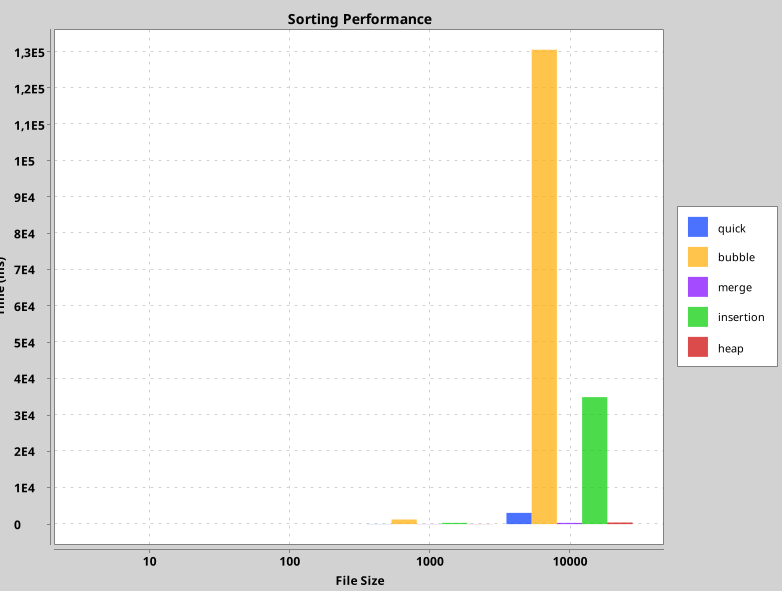

# Информатика (организация и поиск данных) (3 семестр)

| Лабораторная | Ядро                                              | Решение прикладной задачи                                                                                                                                                                                                                                                                                                                                                                                          | UI                                                                                                                                                                                                                                                                                                                                                                                                        | Модульные тесты                                                                                                                                                                                                                                              | Нагрузочные тесты                                                                                                                        |
|--------------|---------------------------------------------------|--------------------------------------------------------------------------------------------------------------------------------------------------------------------------------------------------------------------------------------------------------------------------------------------------------------------------------------------------------------------------------------------------------------------|-----------------------------------------------------------------------------------------------------------------------------------------------------------------------------------------------------------------------------------------------------------------------------------------------------------------------------------------------------------------------------------------------------------|--------------------------------------------------------------------------------------------------------------------------------------------------------------------------------------------------------------------------------------------------------------|------------------------------------------------------------------------------------------------------------------------------------------|
| Лабораторная 1 | `pointer/*.h` и `collectionunqptr/**/*.h`        | Реализованно централизованное хранение объектов (SmrtPtr<T>) и децентрализованное хранение объектов (UnqPtr<T> и ShrdPtr<T>)                                                                                                                                                                                                                                                                                       | Да ([ui](ui))<br/> запуск в runPointerTestsUI()                                                                                                                                                                                                                                                                                                                                                           | да ([pointerTests](test/pointerTests))                                                                                                                                                                                                                       | да ([loadSeq](test/loadSeq)  [loadTests](test/loadTests)  [pointerTests](test/pointerTests))                                             |
| Лабораторная 2 | `sort/impl/*.h`                                  | Реализация плагинной системы для подключения алгоритмов сортировки ([SorterFactory.h](sort/SorterFactory.h) [SorterServiceArray.h](sort/SorterServiceArray.h))  Реализация умного генератора тестовых данных и поддержка множественных форматов для хранения данных (в разделах [helper](test/helper) и [sorts](test/sorts)) Пример использования сортировок на Java через JNI  ([jni](jni) и [Sorts](java/Sorts)) | Да ([ui](ui)) runSequenceTestsUI() для последовательностей [MutableArraySequenceUnqPtr.h](collectionunqptr/sequence/arraysequence/MutableArraySequenceUnqPtr.h) и [MutableListSequenceUnqPtr.h](collectionunqptr/sequence/linkedlistsequence/MutableListSequenceUnqPtr.h).  Java-примеры из `Sorts`  с построением диаграмм и пр. по средствам нативной библиотеки [Sorts](java/Sorts). Сама библиотка -  [jni](jni)| Тесты для Java-примера `SortPerformanceTest` - [SortPerformanceTest.java](java/Sorts/src/main/java/org/example/perfomance/SortPerformanceTest.java), а также в парадигме ААА  [mutableArraySeq](test/mutableArraySeq) [mutableListSeq](test/mutableListSeq)  [array](test/array)| Тесты производительности сортировки  и генерация данных в  [helper](test/helper) [loadSeq](test/loadSeq) [loadTests](test/loadTests) и [SortPerformanceTest.java](java/Sorts/src/main/java/org/example/perfomance/SortPerformanceTest.java). |
| Лабораторная 3 | `gistogram/*.h`                 | Построение гистограммы  Кеширование данных DSL для работы с гистограммами                                                                                                                                                                                                                                                                                                                                          | Нет                                                                                                                                                                                                                                                                                                                                                                                                       | Нет                                                                                                                                                                                                                                                          | Нет                                                                                                                                      |
| Лабораторная 4 | Библиотека на C++ для работы с графами           | REST API с использованием Kotlin + Spring Boot                                                                                                                                                                                                                                                                                                                                                                     | Веб-интерфейс через API                                                                                                                                                                                                                                                                                                                                                                                   | Тесты для CRUD и логики                                                                                                                                                                                                                                      | Тесты производительности API                                                                                                             |
## Лабораторная работа №1

### Описание проекта

В данном проекте реализованы и протестированы различные типы указателей:
- **Smart Pointer** [SmrtPtr.h](pointer/SmrtPtr.h)
- **Unique Pointer** [UnqPtr.h](pointer/UnqPtr.h)
- **Shared Pointer** [ShrdPtr.h](pointer/ShrdPtr.h)
для работы с динамической памятью в C++. 
- Также реализованы контейнеры последовательностей, контейнер, который реализует динамический массив и связный список :
- **Sequence** [Sequence.h](collectionunqptr/sequence/Sequence.h)
- **MutableSequence** [MutableSequence.h](collectionunqptr/sequence/MutableSequence.h)
- **LinkedList** [LinkedListUP.h](collectionunqptr/linkedlist/LinkedListUP.h)
- **DynamicArray** [DynamicArray.h](collectionunqptr/dinamicarray/DynamicArray.h)

### Клонирование репозитория:

```bash
git clone git@github.com:ITech7750/AdvancedContainers.git
```

### Тестирование

Для тестирования производительности указателей был реализован скрипт, который заполняет последовательность с использованием указателей определенного типа и измеряет время выполнения операции. Результаты записываются в файл CSV для последующего анализа. На основе данных из этого файла построен график с использованием Python, который сравнивает время выполнения для каждого типа указателя.

### Построение графиков

Для анализа данных используется Python-скрипт, который строит графики на основе результатов тестов, записанных в CSV файл `load_test_results.csv`.

#### Как запустить:

1. После завершения тестов, убедитесь, что файл `load_test_results.csv` создан.
2. Установите необходимые библиотеки для Python:

```bash
pip install pandas matplotlib
```

3. Запустите Python-скрипт для построения графиков:

```bash
python plot.py
```

Этот скрипт построит графики, на которых сравнивается время выполнения операций для различных типов указателей при разном количестве элементов.

---

## Лабораторная работа №2

Реализованы следующие алгоритмы сортировки:
- **Quick Sort** [QuickSorter.h](sort/impl/QuickSorter.h)
- **Merge Sort** [MergeSorter.h](sort/impl/MergeSorter.h)
- **Bubble Sort** [BubbleSorter.h](sort/impl/BubbleSorter.h)
- **Insertion Sort** [InsertionSorter.h](sort/impl/InsertionSorter.h)
- **Heap Sort** [HeapSorter.h](sort/impl/HeapSorter.h)

При помощи них можно сортировать элементы последовательностей на кастомных указателях, например:
- **MutableArraySequenceUnqPtr.h** [MutableArraySequenceUnqPtr.h](collectionunqptr/sequence/arraysequence/MutableArraySequenceUnqPtr.h)
- **MutableListSequenceUnqPtr.h** [MutableListSequenceUnqPtr.h](collectionunqptr/sequence/linkedlistsequence/MutableListSequenceUnqPtr.h)

Для выбора и управления сортировками реализован сервис сортировок, например:
- **SorterServiceArray.h** [SorterServiceArray.h](sort/SorterServiceArray.h)

Также добавлена возможность работать с этими контейнерами на Java при помощи JNI.

### Простой пример кода для работы с сортировками на Java:

1. Подключим библиотеку:

```java
package org.example.sorter;

import org.example.model.Person;

import java.util.List;

public class SorterService {
    static {
        System.out.println("Loading library...");
        System.load("/home/itech/Desktop/University/AdvancedContainers/cmake-build-debug/libSorterService.so");
        System.out.println("Library loaded successfully.");
    }

    public native static void sortByAge(String fileName, boolean isJson, String algorithm);
    public native static void sortByName(String fileName, boolean isJson, String algorithm);
    public native static double sortByAgeAndGetTime(String fileName, boolean isJson, String algorithm);
    public native static List<Person> getSortedByAge(String fileName, boolean isJson, String algorithm);
}
```

2. Создадим тестовый класс по аналогии с [Person.h](test/testClasses/Person.h):

```java
package org.example.model;

public class Person {
    private String firstName;
    private String lastName;
    private int age;
    private String address;
    private double height;
    private double weight;
    private int yearOfBirth;
    private String phoneNumber;
    private String email;
    private String jobTitle;

    public Person(String firstName, String lastName, int age, String address, double height, double weight,
                  int yearOfBirth, String phoneNumber, String email, String jobTitle) {
        this.firstName = firstName;
        this.lastName = lastName;
        this.age = age;
        this.address = address;
        this.height = height;
        this.weight = weight;
        this.yearOfBirth = yearOfBirth;
        this.phoneNumber = phoneNumber;
        this.email = email;
        this.jobTitle = jobTitle;
    }

    @Override
    public String toString() {
        return firstName + " " + lastName + ", Age: " + age + ", Address: " + address;
    }
}
```

3. Проверим работоспособность библиотеки:

```java
package org.example;

import org.example.sorter.SorterService;
import org.example.model.Person;

import java.util.List;

public class Main {
    public static void main(String[] args) {
        try {
            double timeTaken = SorterService.sortByAgeAndGetTime("data.json", true, "quick");
            System.out.println("Sorting by age took: " + timeTaken + " ms.");

            List<Person> sortedPersons = SorterService.getSortedByAge("data.json", true, "merge");
            System.out.println("Sorted persons:");
            for (Person person : sortedPersons) {
                System.out.println(person);
            }

            SorterService.sortByName("data.txt", false, "heap");
            System.out.println("Sorting by name completed.");

            SorterService.sortByAge("data.txt", false, "bubble");
            System.out.println("Sorting by name completed.");
        } catch (Exception e) {
            System.err.println("An error occurred: " + e.getMessage());
        }
    }
}

```
Наша библиотека предоставляет возможность измерять производительность различных алгоритмов сортировки и визуализировать результаты. Пример использования представлен в файле [SortPerformanceTest.java](java/Sorts/src/main/java/org/example/perfomance/SortPerformanceTest.java)

### Замеры производительности

При тестировании с разным количеством элементов в файлах, например, результаты сортировки для алгоритма Quick Sort выглядят следующим образом:
```bash
Testing algorithm: quick
File: data_10.txt
Loading library...
Library loaded successfully.
Sorting with quick took 0.134237 ms.
Time taken: 0,13 ms (Measured by service), Actual elapsed time: 2 ms
File: data_100.txt
Sorting with quick took 1.91776 ms.
Time taken: 1,92 ms (Measured by service), Actual elapsed time: 2 ms
File: data_1000.txt
Sorting with quick took 49.2537 ms.
Time taken: 49,25 ms (Measured by service), Actual elapsed time: 54 ms
File: data_10000.txt
Sorting with quick took 3106.23 ms.
Time taken: 3106,23 ms (Measured by service), Actual elapsed time: 3151 ms
```

Производя замеры получим следующий результат:

На графике видно, что:
1. Bubble Sort демонстрирует наихудшую производительность.
2. Merge Sort и Heap Sort показывают наилучший результат.
3. Quick Sort находится в среднем диапазоне эффективности.

### Еще примеры ([Sorts](java/Sorts)):
Сортировка по возрасту с записью результата:
```java
SorterService.sortByAge("data.txt", false, "bubble");
```
Сортировка по имени:
```java
SorterService.sortByName("data.txt", false, "heap");
```
Получение времени выполнения сортировки:
```java
double timeTaken = SorterService.sortByAgeAndGetTime("data.json", true, "quick");
```
Получение отсортированного списка объектов:
```java
List<Person> sortedPersons = SorterService.getSortedByAge("data.json", true, "merge");
```
Весь функционал для работы с кастомными контенерами покрыт тестами в парадигме AAA.


## Лабораторная работа №3
### Описание проекта

В третьей лабораторной работе реализована система для обработки и анализа данных с использованием пар ключ-значение, хэш-таблиц, словарей и построения гистограмм. Проект включает следующие основные компоненты:

1. [Pair.h](gistogram/model/dictionary/Pair.h)

Класс Pair предназначен для хранения пар ключ-значение:

Конструктор: инициализирует ключ и значение.
Методы: getKey, getValue для доступа к ключу и значению; copy создает новую пару с тем же ключом, но другим значением; equal и оператор == проверяют равенство пар.

2. [HashMap.h](gistogram/model/dictionary/HashMap.h)

HashMap представляет собой хэш-таблицу для хранения данных в виде пар ключ-значение:

Метод hashCode: вычисляет хэш-код ключа.
Основные методы: insert добавляет новые пары, get и operator[] извлекают значение по ключу, contains проверяет наличие ключа, getKeys возвращает все ключи.

3. [Dictionary.h](gistogram/model/dictionary/Dictionary.h)

Dictionary базируется на HashMap и предназначен для работы с коллекцией значений:

Метод add: добавляет пару ключ-значение.
Метод addStatistic: рассчитывает и добавляет статистические данные с использованием предиката.
Методы getData и getStatistic: предоставляют доступ к данным и статистике.

4. [GistogramScope.h](gistogram/dsl/GistogramScope.h) и [Gistogram.h](gistogram/model/Gistogram.h)

GistogramScope является основным классом для конфигурирования и построения гистограмм. Он предоставляет методы для добавления данных, настройки параметров и включения вычисления статистики.

Gistogram представляет собой структуру данных для хранения и анализа пар ключ-значение, соответствующих параметрам и данным гистограммы.

Метод addData: добавляет данные для анализа.

Метод parameter: определяет параметры с использованием предикатов.

Метод enableStatistic: включает расчет статистики.

Метод buildGistogram: создает и возвращает гистограмму.

В данном проекте реализован специализированный "dsl" для создания и анализа гистограмм на основе шаблонных классов GistogramScope и Gistogram. Этот DSL предоставляет пользователям удобные средства для работы с гистограммами, позволяя конфигурировать параметры, добавлять данные и вычислять статистику.

Далее все это будем использовать в ЛР4.
# Лабораторная работа №4

## Описание

В этой лабораторной работе был реализован API для работы с логистическими данными. Использовалась библиотека, написанная на C++, которая предоставляет функции для создания и анализа графов, а также нахождения кратчайших путей между вершинами. Для связи C++ и Kotlin использовался JNI.

## Реализованные функции

### Библиотека на C++

1. **Генерация графов**:
    - Создание графов с логистическими данными (города и дороги).
    - Поддержка как направленных, так и ненаправленных графов.
2. **Чтение графов из файла**:
    - Поддержка текстовых форматов файлов с описанием графа.
3. **Анализ графов**:
    - Нахождение кратчайших путей между двумя вершинами (по времени и по количеству вершин).

### API на Kotlin

Реализован REST API с использованием Spring Boot для управления логистическими данными:

1. **CRUD-операции** для городов и дорог.
2. **Вызов функций из библиотеки на C++ через JNI**.
3. **Форматы данных**:
    - JSON для взаимодействия с клиентом.
    - Текстовые файлы для обработки данных библиотеки.

### Использование PostgreSQL

1. Хранение данных о городах и дорогах.
2. Использование Spring Data JPA для управления базой данных.

## Описание API


### 1. POST `/api/logistics/logistic`
Создание логистических данных (графа).

#### Пример запроса:
```bash
curl -X POST "http://localhost:8080/api/logistics/logistic" \
-d "resultFilePath=/tmp/logistics_result.txt" \
-d "cityAmount=10" \
-d "roadAmount=20" \
-d "cargo=100"
```

#### Параметры:
- `resultFilePath`: Путь для сохранения результата.
- `cityAmount`: Количество городов.
- `roadAmount`: Количество дорог.
- `cargo`: Общий объём груза.

### 2. POST `/api/logistics/logistic/from-file`
Создание логистических данных из файла.

#### Пример запроса:
```bash
curl -X POST "http://localhost:8080/api/logistics/logistic/from-file" \
-F "dataFile=@logistics_input.txt" \
-F "resultFilePath=/tmp/logistics_result.txt" \
-F "startCity=CityA" \
-F "endCity=CityB" \
-F "cargo=200"
```

#### Формат входного файла (`logistics_input.txt`):
```
{Road1;15.5;100;CityA;CityB}
{Road2;10.2;80;CityB;CityC}
{Road3;5.5;60;CityA;CityC}
{Road4;12.8;90;CityC;CityD}
{Road5;7.3;70;CityD;CityE}
```

#### Параметры:
- `dataFile`: Файл с данными о дорогах и городах.
- `resultFilePath`: Путь для сохранения результата.
- `startCity`: Начальный город.
- `endCity`: Конечный город.
- `cargo`: Объём груза.

### 3. GET `/api/logistics/greeting`
Возвращает приветственное сообщение.

#### Пример запроса:
```bash
curl -X GET "http://localhost:8080/api/logistics/greeting"
```

#### Ответ:
```
"Hello from C++"
```

### 4. POST `/api/logistics/city`
Сохранение информации о городе.

#### Пример запроса:
```bash
curl -X POST http://localhost:8080/api/logistics/city \
-H "Content-Type: application/json" \
-d '{
  "name": "CityA",
  "cargoToDrop": 50,
  "x": 1.5,
  "y": 3.2
}'
```

#### Пример ответа:
```json
{
  "id": 1,
  "name": "CityA",
  "cargoToDrop": 50,
  "x": 1.5,
  "y": 3.2
}
```

### 5. POST `/api/logistics/road`
Сохранение информации о дороге.

#### Пример запроса:
```bash
curl -X POST http://localhost:8080/api/logistics/road \
-H "Content-Type: application/json" \
-d '{
  "name": "Road1",
  "length": "15.5",
  "maxSpeed": "100",
  "start": {
    "id": 1
  },
  "end": {
    "id": 2
  }
}'
```

#### Пример ответа:
```json
{
  "id": 1,
  "name": "Road1",
  "length": "15.5",
  "maxSpeed": "100",
  "start": {
    "id": 1,
    "name": "CityA",
    "cargoToDrop": 50,
    "x": 1.5,
    "y": 3.2
  },
  "end": {
    "id": 2,
    "name": "CityB",
    "cargoToDrop": 30,
    "x": 2.5,
    "y": 4.1
  }
}
```

### 6. POST `/api/logistics/vertex`
Создание графа на основе городов и дорог.

#### Пример запроса:
```bash
curl -X POST "http://localhost:8080/api/logistics/vertex" \
-d "resultFilePath=/tmp/vertex_result.txt" \
-d "cityAmount=15" \
-d "roadAmount=25"
```

#### Параметры:
- `resultFilePath`: Путь для сохранения результата.
- `cityAmount`: Количество городов.
- `roadAmount`: Количество дорог.

### 7. POST `/api/logistics/histogram`
Построение гистограммы на основе данных.

#### Пример запроса:
```bash
curl -X POST "http://localhost:8080/api/logistics/histogram" \
-d "path=/tmp/histogram_result.txt" \
-d "option=distribution" \
-d "amount=100" \
-d "enableStatistic=1" \
-d "filter1=10" \
-d "filter2=20" \
-d "filter3=30" \
-d "filter4=40" \
-d "birthYear=1990" \
-d "cityStartsWith=A"
```

#### Параметры:
- `path`: Путь для сохранения результата.
- `option`: Тип гистограммы (например, "distribution").
- `amount`: Объём данных.
- `enableStatistic`: Включить или выключить статистику (1 или 0).
- `filter1` - `filter4`: Параметры фильтрации.
- `birthYear`: Год рождения для фильтрации.
- `cityStartsWith`: Фильтр по начальной букве города.

### 8. POST `/api/logistics/bag`
Создание данных о сумке.

#### Пример запроса:
```bash
curl -X POST "http://localhost:8080/api/logistics/bag" \
-d "path=/tmp/bag_result.txt" \
-d "amount=50" \
-d "maxCapacity=100" \
-d "maxVolume=200"
```

#### Параметры:
- `path`: Путь для сохранения результата.
- `amount`: Количество объектов в сумке.
- `maxCapacity`: Максимальная вместимость.
- `maxVolume`: Максимальный объём.

### 9. GET `/api/logistics/cities`
Получение списка всех городов.

#### Пример запроса:
```bash
curl -X GET "http://localhost:8080/api/logistics/cities"
```

#### Пример ответа:
```json
[
  {
    "id": 1,
    "name": "CityA",
    "cargoToDrop": 50,
    "x": 1.5,
    "y": 3.2
  },
  {
    "id": 2,
    "name": "CityB",
    "cargoToDrop": 30,
    "x": 2.5,
    "y": 4.1
  }
]
```

### 10. GET `/api/logistics/roads`
Получение списка всех дорог.

#### Пример запроса:
```bash
curl -X GET "http://localhost:8080/api/logistics/roads"
```

#### Пример ответа:
```json
[
  {
    "id": 1,
    "name": "Road1",
    "length": "15.5",
    "maxSpeed": "100",
    "start": {
      "id": 1,
      "name": "CityA",
      "cargoToDrop": 50,
      "x": 1.5,
      "y": 3.2
    },
    "end": {
      "id": 2,
      "name": "CityB",
      "cargoToDrop": 30,
      "x": 2.5,
      "y": 4.1
    }
  }
]
```

### 11. DELETE `/api/logistics/city/{name}`
Удаление города по его имени.

#### Пример запроса:
```bash
curl -X DELETE "http://localhost:8080/api/logistics/city/CityA"
```

#### Ответ:
```
HTTP/1.1 204 No Content
```

### 12. POST `/api/logistics/logistic/undirected`
Создание логистических данных с неориентированными дорогами.

#### Пример запроса:
```bash
curl -X POST "http://localhost:8080/api/logistics/logistic/undirected" \
-d "resultFilePath=/tmp/logistic_undirected_result.txt" \
-d "cityAmount=10" \
-d "roadAmount=20" \
-d "cargo=100"
```

#### Параметры:
- `resultFilePath`: Путь для сохранения результата.
- `cityAmount`: Количество городов.
- `roadAmount`: Количество дорог.
- `cargo`: Общий объём груза.

### 13. POST `/api/logistics/logistic/from-file/undirected`
Создание логистических данных из файла с неориентированными дорогами.

#### Пример запроса:
```bash
curl -X POST "http://localhost:8080/api/logistics/logistic/from-file/undirected" \
-F "dataFile=@logistics_input.txt" \
-F "resultFilePath=/tmp/logistic_undirected_result.txt" \
-F "startCity=CityA" \
-F "endCity=CityB" \
-F "cargo=200"
```

#### Параметры:
- `dataFile`: Файл с данными о дорогах и городах.
- `resultFilePath`: Путь для сохранения результата.
- `startCity`: Начальный город.
- `endCity`: Конечный город.
- `cargo`: Объём груза.

### 14. POST `/api/logistics/vertex/undirected`
Создание графа с неориентированными дорогами.

#### Пример запроса:
```bash
curl -X POST "http://localhost:8080/api/logistics/vertex/undirected" \
-d "resultFilePath=/tmp/vertex_undirected_result.txt" \
-d "cityAmount=15" \
-d "roadAmount=25"
```

#### Параметры:
- `resultFilePath`: Путь для сохранения результата.
- `cityAmount`: Количество городов.
- `roadAmount`: Количество дорог.

### 15. POST `/api/logistics/histogram/from-file`
Создание гистограммы из файла.

#### Пример запроса:
```bash
curl -X POST "http://localhost:8080/api/logistics/histogram/from-file" \
-d "path=/tmp/histogram_file_result.txt" \
-d "filePath=/path/to/input/file.txt" \
-d "option=distribution" \
-d "amount=100" \
-d "enableStatistic=1" \
-d "filter1=10" \
-d "filter2=20" \
-d "filter3=30" \
-d "filter4=40" \
-d "birthYear=1990" \
-d "cityStartsWith=A"
```

#### Параметры:
- `path`: Путь для сохранения результата.
- `filePath`: Путь к входному файлу.
- `option`: Тип гистограммы.
- `amount`: Объём данных.
- `enableStatistic`: Включить или выключить статистику (1 или 0).
- `filter1` - `filter4`: Параметры фильтрации.
- `birthYear`: Год рождения для фильтрации.
- `cityStartsWith`: Фильтр по начальной букве города.

### 16. POST `/api/logistics/logistic/from-file/vertex/undirected`
Создание неориентированных вершин логистики из файла.

#### Пример запроса:
```bash
curl -X POST "http://localhost:8080/api/logistics/logistic/from-file/vertex/undirected" \
-F "dataFile=@logistics_input.txt" \
-F "resultFilePath=/tmp/vertex_undirected_result.txt" \
-F "startCity=CityA" \
-F "endCity=CityB"
```

#### Параметры:
- `dataFile`: Файл с данными о дорогах и городах.
- `resultFilePath`: Путь для сохранения результата.
- `startCity`: Начальный город.
- `endCity`: Конечный город.

## Docker

Для запуска проекта с использованием Docker Compose выполните следующие шаги:

1. **Соберите проект с помощью Gradle**:
   ```bash
   ./gradlew build
   ```

2. **Запустите проект с помощью Docker Compose**:
   ```bash
   docker-compose up --build
   ```

### Docker Compose конфигурация:

Docker Compose конфигурация включает в себя следующие сервисы:

- **app**: Сервис на основе Spring Boot, реализующий REST API.
- **db**: PostgreSQL база данных для хранения данных о городах


## Технологии

- **C++**: Для работы с графами и реализации алгоритмов.
- **Kotlin**: Реализация REST API с использованием Spring Boot.
- **JNI**: Для интеграции функций C++ с Kotlin.
- **PostgreSQL**: Для хранения данных о городах и дорогах.
- **Spring Data JPA**: Для работы с базой данных.

